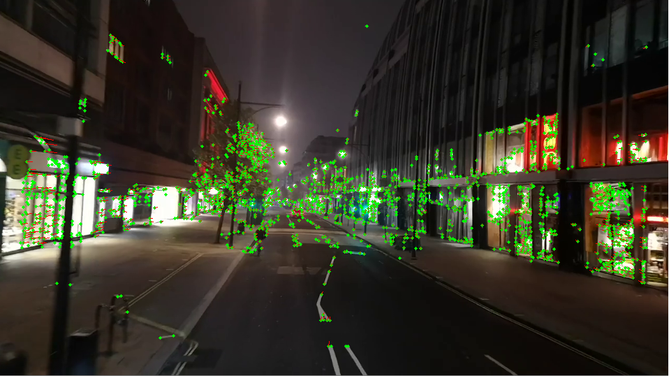
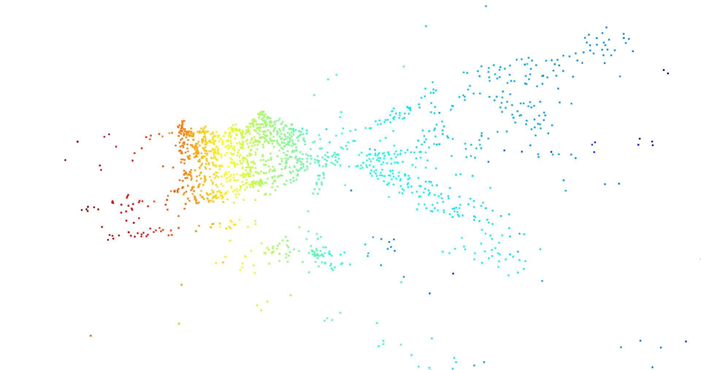
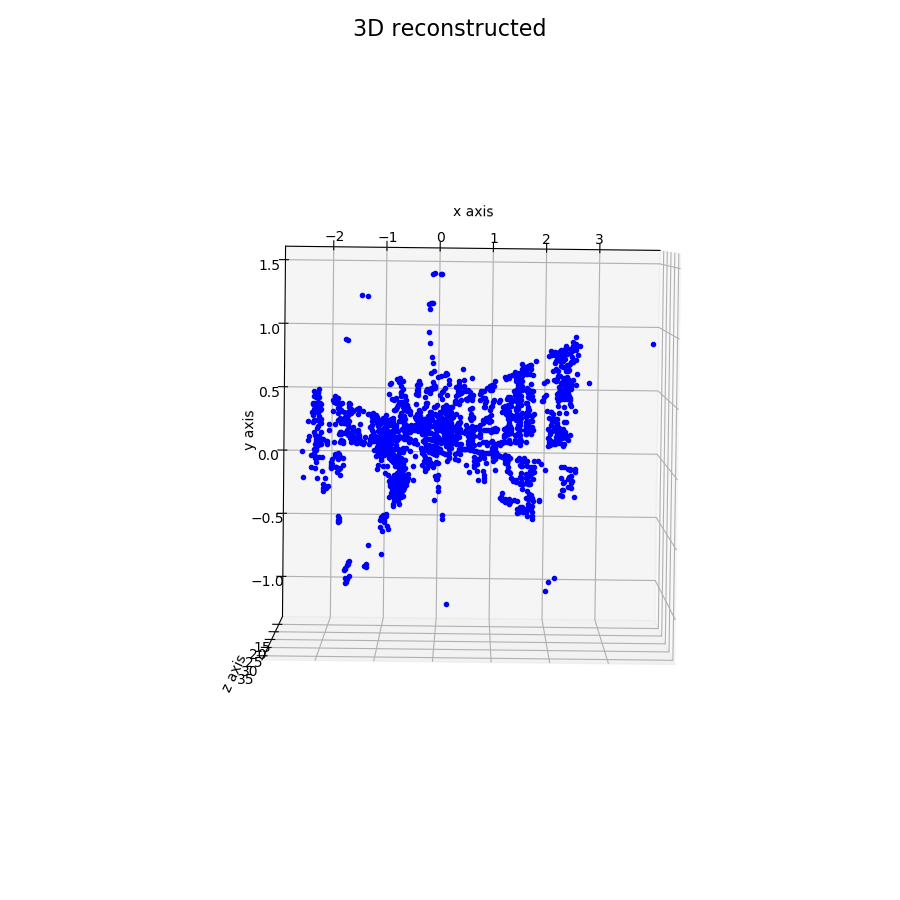

# SLAM

Source: https://github.com/filchy/slam-python.

## Extra data

The new video data from the [video-sim2real](http://opencas.dkfz.de/video-sim2real/) dataset have been generated as:

```ffmpeg -r 5 -f image2 -s 1920x1080 -i translation%04d.png -vcodec libx264 -crf 25  -pix_fmt yuv420p scene_4_translation_sequence_5hz.mp4```

## Original Documentation
#### Simultaneous localization and mapping


### point cloud using open3d

### point cloud using matplotlib


## Libraries used
* [opencv](https://opencv.org/)
* [numpy](https://numpy.org/)
* [open3d](http://www.open3d.org/)
* [matplotlib](https://matplotlib.org/)
